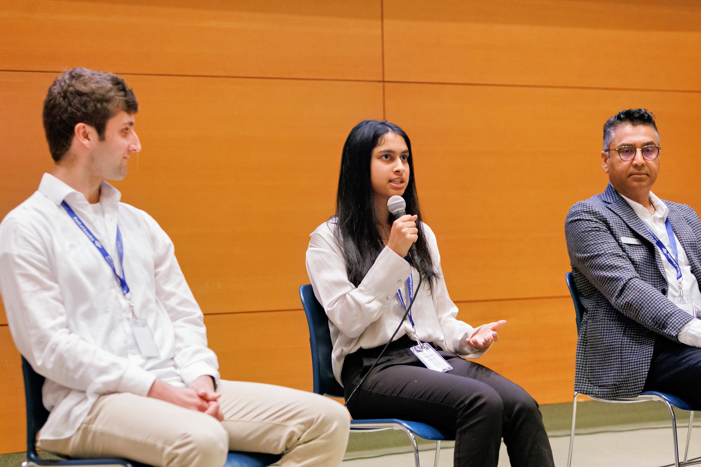

  <!-- Text Content -->
  

    <h3>Leadership Roles</h4>
    

      I have served in various leadership positions to support the Caltech community:
    

    <ul>
      <li><strong>Editor-in-Chief, <a href="https://curj.caltech.edu/">Caltech Undergraduate Research Journal</a></strong>:  
        I manage a team of over 10 students in editing and designing a yearly publication highlighting select undergraduate research performed at Caltech. 
        I also conducted faculty interviews for the 2023 and 2024 issues of the journal.
      </li>
      <li><strong>Campus Representative, <a href="https://www.aspirations.org/aic-campus-reps">National Center for Women & Information Technology (NCWIT)</a></strong>:  
        I have organized social events for undergraduate women in engineering and provided individual mentorship to high school girls interested in pursuing computer science.
      </li>
      <li><strong>President, Caltech Debate Society</strong>:  
        I hosted discussions on political topics and current events for undergraduate and graduate participants.
      </li>
    </ul>
  

  <!-- Image Content -->
  

    
    

      Speaking at the 2024 NCWIT Los Angeles Affiliate Award Ceremony for high school students
    

  

<h3>Teaching</h4>

  I have always been passionate about teaching and mentorship. In 2020, I co-founded 
  <strong><a href="https://www.algostem.org/">AlgoSTEM</a></strong>, a non-profit dedicated to providing free STEM education to all. 
  I uploaded solutions to coding problems on YouTube and developed full courses on Udemy, including a free introductory Python course with 
  <strong>65k+ enrollments</strong>. I also hosted free summer camps, teaching programming and mathematics to over 400 students. Over the past two years, 
  my role at AlgoSTEM has shifted to that of an advisor. I’ve helped manage a team of eight students in continuing to create Udemy courses (with 
  <strong>100k+ collective enrollments</strong>), host camps, and organize a high school math competition.

  At Caltech, I’ve pursued my passion for teaching by serving as a **Teaching Assistant** for several courses, specifically:

<ul>
  <li><strong>CS 38: Algorithms</strong> (Spring 2023, Spring 2024)</li>
  <li><strong>CS 21: Decidability & Tractability</strong> (Winter 2023)</li>
  <li><strong>ACM 104: Applied Linear Algebra</strong> (Fall 2023)</li>
</ul>
